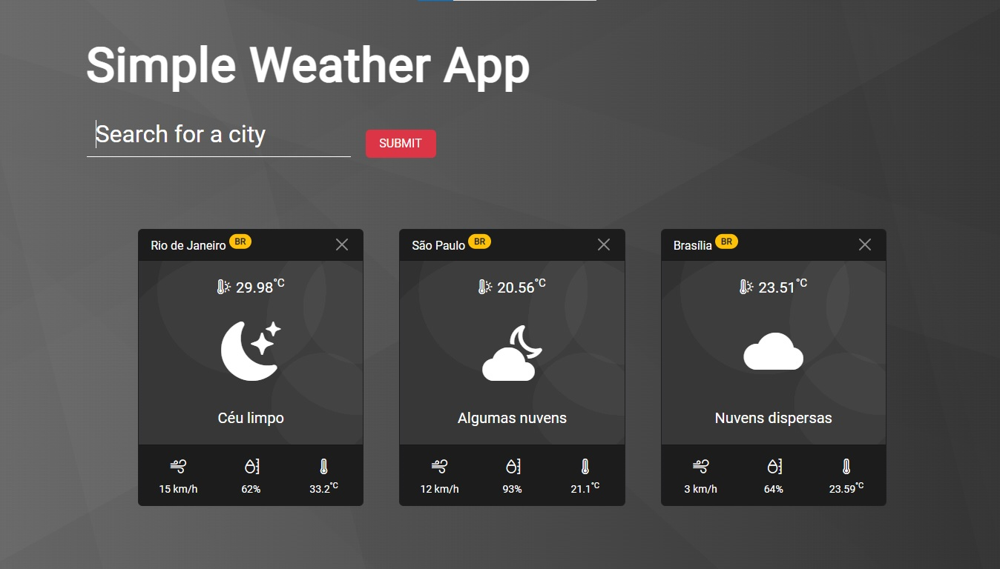
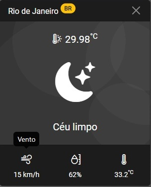
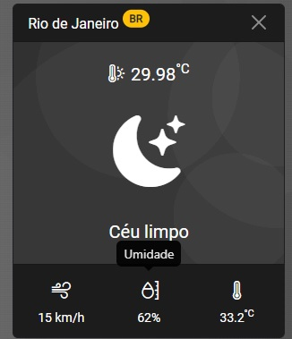
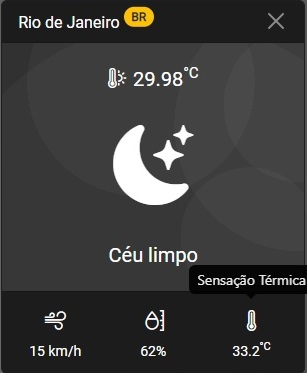

# Simple Weather App

Este é um projeto simples de acompanhamento de clima de cidades.

Começamos com uma simples barra de pesquisa para o usuário inserir o nome da cidade que ele deseja saber o clima, caso passe nas vericações, como input preenchido, nome de cidade válida e nome de cidade não repitida, é devolvido as informações sobre aquela cidade em um card, abaixo da entrada de pesquisa.

Cada card vai possuir as mesmas disposições de informações, tais como:

- Nome da Cidade;
- Código do País (EUA, BR, UK, etc...);
- Temperatura em Celsius;
- Icone e descrição do clima ;
- Velocidade do vento;
- Umidade;
- Sensação térmica.

Cada card também possui a opção de ser excluido.

## Referência

Este projeto foi criado com base em um repositório de tutoriais e foi construído seguindo um tutorial disponível em [tutsplus](https://tutsplus.com/).

- [Project Based Learning](https://github.com/practical-tutorials/project-based-learning)
- [Build a Simple Weather App With Vanilla JavaScript](https://webdesign.tutsplus.com/tutorials/build-a-simple-weather-app-with-vanilla-javascript--cms-33893))

## Aprendizados

- HTML5;
- CSS3;
- BootStrap;
- JavaScript;

## Screenshots

