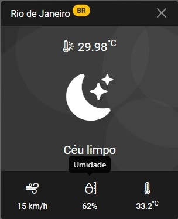

# Simple Weather App

Este é um projeto que permite o acompanhamento do clima de diversas cidades ao redor do mundo de maneira simples e intuitiva utilizando a API [OpenWeatherMap](https://openweathermap.org/).

A interface do projeto é composta por uma barra de pesquisa onde o usuário pode inserir o nome da cidade desejada. Após passar por verificações, tais como preenchimento correto do input e validação do nome da cidade, as informações sobre o clima daquela cidade são exibidas em um card abaixo da barra de pesquisa.

Cada card apresenta informações padronizadas, como o nome da cidade, o código do país, a temperatura em Celsius, o ícone e a descrição do clima, a velocidade do vento, a umidade e a sensação térmica. Além disso, cada card possui a opção de ser excluído, permitindo que o usuário personalize a lista de cidades exibidas.

## Referência

Este projeto foi criado com base em um repositório de tutoriais e foi construído seguindo um tutorial disponível em [tutsplus](https://tutsplus.com/).

- [Project Based Learning](https://github.com/practical-tutorials/project-based-learning)
- [Build a Simple Weather App With Vanilla JavaScript](https://webdesign.tutsplus.com/tutorials/build-a-simple-weather-app-with-vanilla-javascript--cms-33893))

## Aprendizados

- HTML5;
- CSS3;
- BootStrap;
- JavaScript;

## Screenshots

